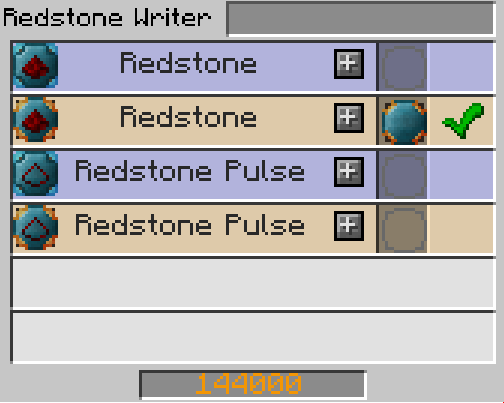

# Read OpenBlocks Tanks

## Descriptions
This script allows you to display the content of an OpenBlocks tank.

## Limitations
This only works for cube shapes.

## How to use
The OpenComputers mod can't directly interface with the OpenBlocks tank.
I have used the Integrated Dynamics mod to solve that. With this mode we can use a fluid reader to read the current fluid level of one tank. (only one block)
For this script to work we need a measurement of 1 block per z level of the tank.
These measurements then needs to be summed up and supplied to the computer via redstone signal.

## Example set-up

### Mods used
* OpenComputers
* OpenBlocks
* Integrated Dynamics

This is the set-up that I have used.
There is 1 fluid reader per z layer. If we sum up all the reader results and multiply them by the width and length of the tank we get the volume. This works because the OpenBlocks tanks connect and the fluid level is the same for every tank on the same level.

In the bottom left we can see a "Variable Store" this block holds all of our variables. Here I have visualized the calculation I have made to sum all the individual measurements. 
Note all these variable except for the "sum of all variables" variable need to stay in the variable storage. 

These calculations can be made via the "Logic Programmer". It is also possible to add the result of additions together.

Now to output this value to the computer we need a "Redstone Writer". The variable which contains the result of the sum of all measurements is put in the redstone slot that takes an integer. (integer slots are yellow)
This will cause the "Redstone Writer" to output a redstone signal that has the strength of the sum of all fluid levels.

That's it for the set-up the rest is handled by the script.